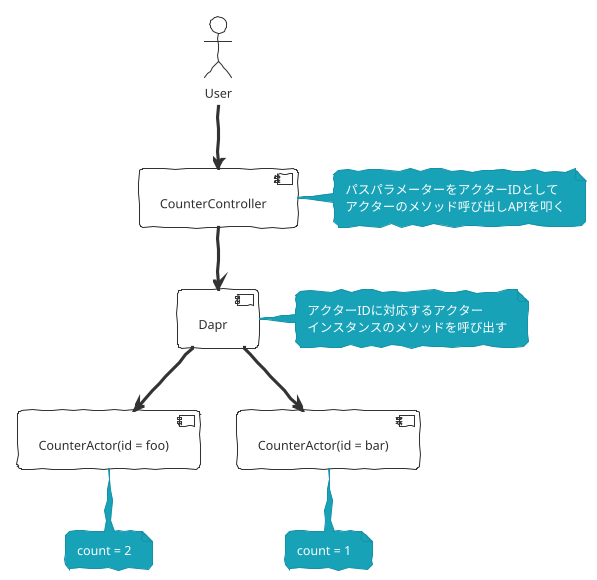

```plantuml
@startuml dapr-actor-example
!theme sketchy-outline

actor User as user
[CounterController] as controller
[Dapr] as dapr
[CounterActor(id = foo)] as foo
[CounterActor(id = bar)] as bar

note right of controller
パスパラメーターをアクターIDとして
アクターのメソッド呼び出しAPIを叩く
end note

note right of dapr
アクターIDに対応するアクター
インスタンスのメソッドを呼び出す
end note

note bottom of foo
count = 2
end note

note bottom of bar
count = 1
end note

user --> controller
controller --> dapr
dapr --> foo
dapr --> bar
@enduml
```
